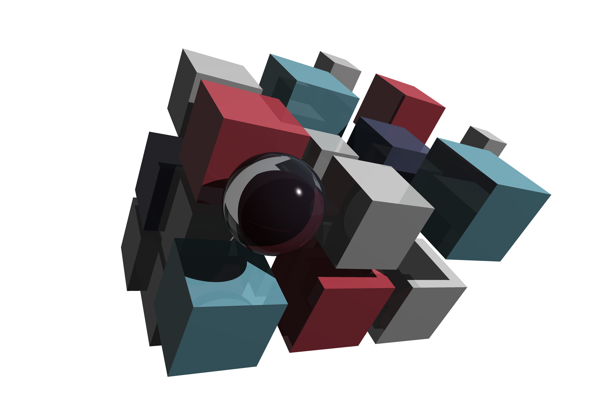
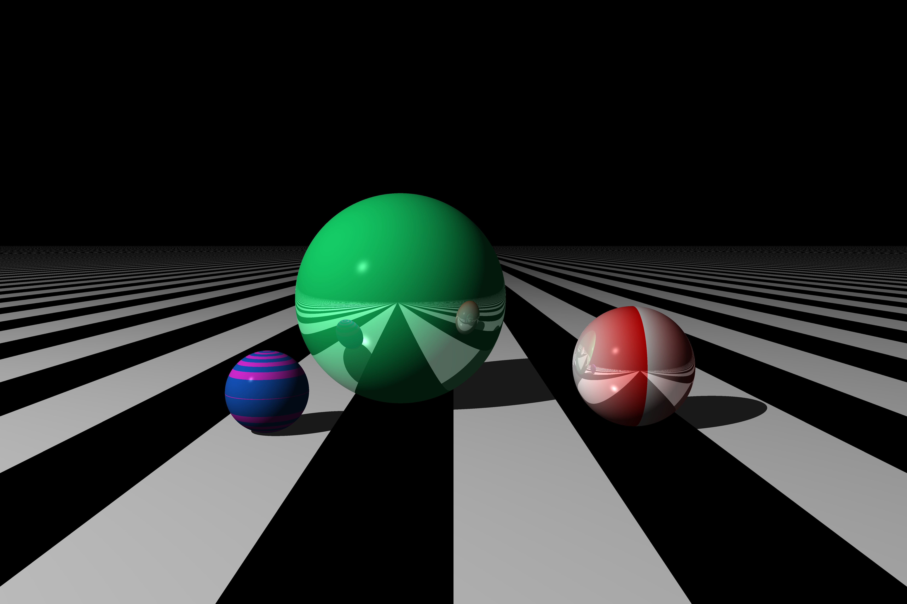
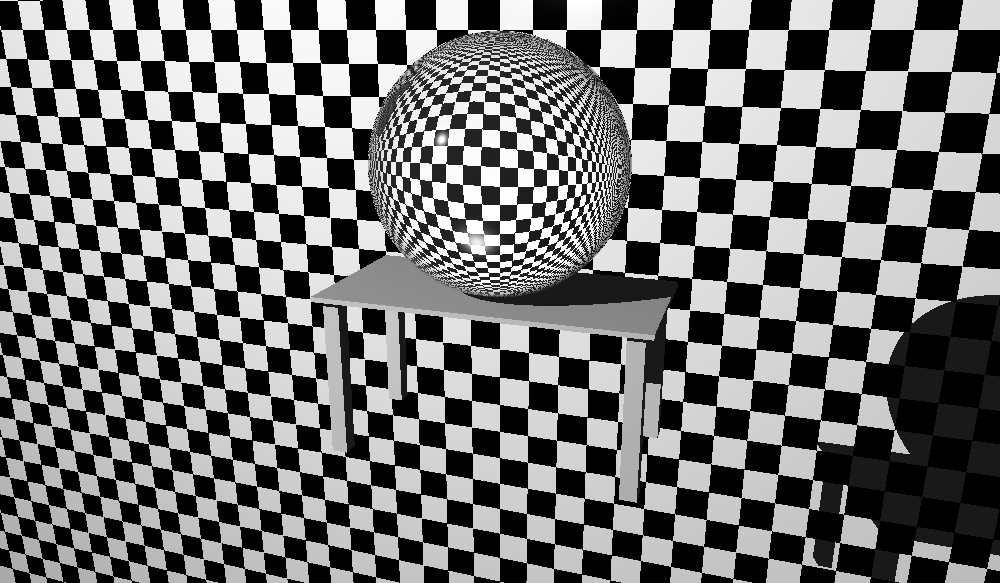

I learned how to make a 3D ray tracer from the awesome book [The Ray Tracer Challenge](http://raytracerchallenge.com/).

This ray tracer is parallelized with OpenMP and has shadows, reflection, refraction, transparency, various patterns, and the Fresnel effect.

# Example renderings
  

# How to run
The project files that generate pictures like those above are in `src/projects`. Pick a file in there to render and run

```
cmake -DCMAKE_BUILD_TYPE=Release -B build && cmake --build build && ./build/src/projects/[filename] && open [filename].ppm
```
